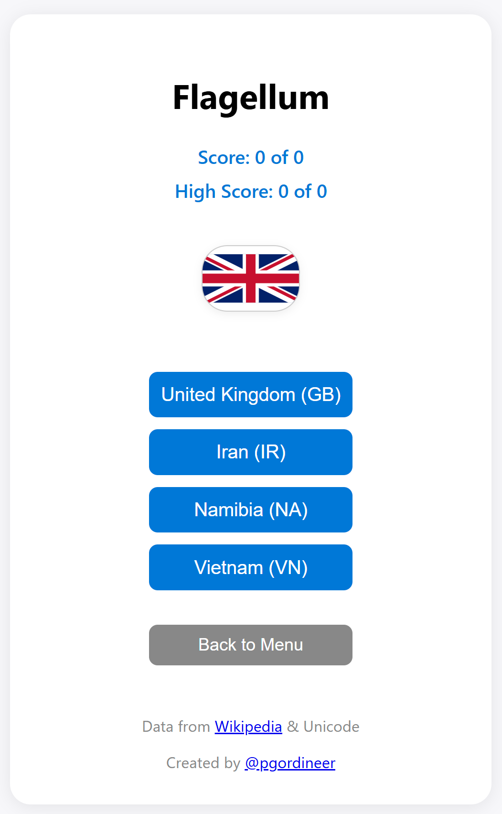

# Flagellum

A beautiful, mobile-friendly flag guessing game for learning world flags. Guess the country by its flag (image from Wikipedia), using either the country name or its 2-letter code, or try the fun multiple choice mode!

---

## Play Now

👉 [Flagellum - Flag Guessing Game](https://pgordineer.github.io/Flagellum/)

---

## Features

- 🌍 **Two Game Modes:**
  - **Entry Mode:** Type the country name or ISO 2-letter code. Get hints if you need help!
  - **Multiple Choice:** Pick the correct country from four options. Partial credit for fewer attempts.
- 🏳️ **Wikipedia flag images** and Unicode flag emojis (on mobile).
- 🏆 **Score and High Score tracking** (with partial credit and fractions, e.g. 2/3, 1/2, etc.).
- 💾 **Personal high scores** are saved in your browser.
- 📱 **Mobile-friendly, modern UI** with beautiful, responsive design.
- 🔗 **Learn more** about each flag with a direct Wikipedia link.
- 👨‍💻 **Created by [@pgordineer](https://github.com/pgordineer)**

---

## Data sources
- [Wikipedia: Emoji flags](https://en.wikipedia.org/wiki/Emoji_flags)
- [Wikipedia: Gallery of sovereign state flags](https://en.wikipedia.org/wiki/Gallery_of_sovereign_state_flags)

---

Flagellum is open source and designed for fun flag learning!
